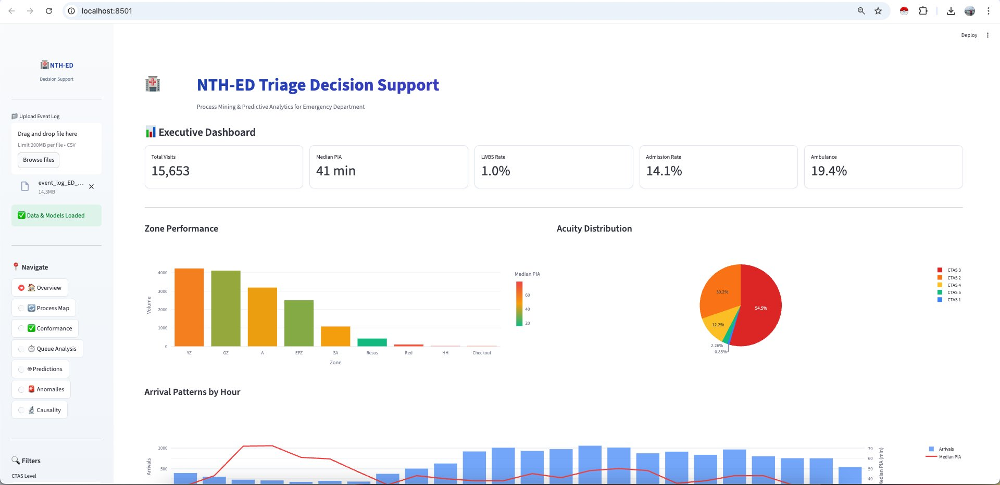

# NTH Project - Data Analysis & Dashboard

A comprehensive data analysis project with an interactive Streamlit dashboard for visualizing and exploring NTH (New Technology Horizon) metrics and insights.

## 🖼️ Dashboard Preview



*The interactive dashboard showing Executive Dashboard with key metrics, zone performance, acuity distribution, and arrival patterns for Emergency Department triage decision support.*

## 📋 Table of Contents

- [Overview](#overview)
- [Features](#features)
- [Project Structure](#project-structure)
- [Prerequisites](#prerequisites)
- [Installation](#installation)
- [Configuration](#configuration)
- [Running the Application](#running-the-application)
- [Usage Guide](#usage-guide)
- [Data Pipeline](#data-pipeline)
- [Troubleshooting](#troubleshooting)
- [Contributing](#contributing)
- [License](#license)

## 🎯 Overview

The NTH-ED (Emergency Department) Triage Decision Support project provides end-to-end data processing and visualization capabilities for analyzing emergency department performance metrics. The project includes:

- **Process Mining & Predictive Analytics** for Emergency Department operations
- Automated data ingestion and preprocessing of event logs
- Feature engineering and transformation pipelines
- Interactive Streamlit dashboard with multiple analytical views
- Real-time monitoring of key performance indicators (KPIs)

**Key Metrics Tracked:**
- Total Visits and Patient Volume
- Median PIA (Patient Intake Assessment time)
- LWBS Rate (Left Without Being Seen)
- Admission Rate
- Ambulance Utilization
- Zone Performance across different ED areas
- Acuity Distribution (CTAS levels 1-5)
- Arrival Patterns by Hour

## ✨ Features

- **Event Log Upload**: Drag-and-drop interface for uploading ED event logs (CSV format)
- **Executive Dashboard**: High-level KPI overview with key metrics at a glance
- **Process Map Visualization**: Interactive process flow analysis
- **Conformance Checking**: Validate processes against standard protocols
- **Queue Analysis**: Detailed waiting time and queue length analytics
- **Predictive Models**: Machine learning predictions for patient flow
- **Anomaly Detection**: Identify unusual patterns in ED operations
- **Causality Analysis**: Root cause analysis for performance issues
- **Zone Performance Tracking**: Compare performance across ED zones (YZ, GZ, A, EPZ, SA)
- **Acuity Distribution**: Monitor CTAS (Canadian Triage and Acuity Scale) levels
- **Arrival Pattern Analysis**: Hourly arrival trends with median PIA overlay
- **Export Capabilities**: Download processed data and reports
- **Responsive Design**: Works on desktop and tablet devices

## 📁 Project Structure

```
nth-ed-project/
├── data/
│   ├── raw/                 # Raw event log files
│   ├── processed/           # Cleaned and processed data
│   └── output/              # Generated reports and exports
├── src/
│   ├── preprocessing/       # Data cleaning and transformation scripts
│   ├── process_mining/      # Process discovery and conformance
│   ├── analysis/            # Statistical analysis modules
│   ├── predictions/         # ML models for predictive analytics
│   ├── visualization/       # Plotting and chart generation
│   └── utils/               # Helper functions and utilities
├── dashboard/
│   ├── app.py               # Main Streamlit application
│   ├── components/          # Dashboard UI components
│   │   ├── overview.py      # Executive dashboard
│   │   ├── process_map.py   # Process mining visualizations
│   │   ├── conformance.py   # Conformance checking
│   │   ├── queue.py         # Queue analysis
│   │   ├── predictions.py   # Predictive models view
│   │   ├── anomalies.py     # Anomaly detection
│   │   └── causality.py     # Causality analysis
│   └── styles/              # CSS and styling files
├── models/                  # Trained ML models
├── notebooks/               # Jupyter notebooks for exploration
├── tests/                   # Unit and integration tests
├── config/
│   └── config.yaml          # Configuration settings
├── images/
│   └── dashboard_screenshot.png  # Dashboard preview image
├── requirements.txt         # Python dependencies
├── environment.yml          # Conda environment specification
├── .gitignore
└── README.md
```

## 🔧 Prerequisites

Before you begin, ensure you have the following installed:

- **Python**: Version 3.8 or higher
- **pip**: Python package installer
- **Git**: For version control
- **Virtual Environment**: Recommended (venv or conda)

### System Requirements

- OS: Windows 10+, macOS 10.14+, or Linux
- RAM: Minimum 4GB (8GB recommended)
- Disk Space: At least 2GB free

## 🚀 Installation

### Step 1: Clone the Repository

```bash
git clone https://github.com/your-username/nth-project.git
cd nth-project
```

**Note:** Make sure the `images/` folder contains the `dashboard_screenshot.png` file for the README to display the preview image correctly.

### Step 2: Create Virtual Environment

**Option A: Using venv (recommended)**

```bash
# Create virtual environment
python -m venv venv

# Activate virtual environment
# On Windows:
venv\Scripts\activate
# On macOS/Linux:
source venv/bin/activate
```

**Option B: Using conda**

```bash
# Create conda environment
conda env create -f environment.yml

# Activate conda environment
conda activate nth-project
```

### Step 3: Install Dependencies

```bash
# Upgrade pip
pip install --upgrade pip

# Install required packages
pip install -r requirements.txt
```

### Step 4: Verify Installation

```bash
# Check if all packages are installed correctly
python -c "import streamlit, pandas, numpy, plotly; print('All packages installed successfully!')"
```

## ⚙️ Configuration

### 1. Set Up Configuration File

Copy the example configuration file and modify it according to your needs:

```bash
cp config/config.example.yaml config/config.yaml
```

### 2. Edit Configuration Settings

Open `config/config.yaml` and update the following parameters:

```yaml
# Data paths
data:
  raw_data_path: "data/raw/"
  processed_data_path: "data/processed/"
  output_path: "data/output/"

# Dashboard settings
dashboard:
  title: "NTH Analytics Dashboard"
  port: 8501
  host: "localhost"

# Analysis parameters
analysis:
  date_column: "date"
  metrics: ["metric1", "metric2", "metric3"]
  aggregation: "daily"
```

### 3. Prepare Data Files

Place your event log files in the `data/raw/` directory. 

**Required Event Log Format (CSV):**
The event log should contain the following columns:
- `case_id`: Unique patient visit identifier
- `activity`: Activity/event name (e.g., Registration, Triage, Assessment)
- `timestamp`: Date and time of the event
- `resource`: Staff member or resource involved
- Additional columns: zone, acuity (CTAS level), arrival_mode, etc.

**Example:**
```csv
case_id,activity,timestamp,resource,zone,acuity
12345,Registration,2024-01-15 08:30:00,Nurse_A,YZ,3
12345,Triage,2024-01-15 08:35:00,Nurse_B,YZ,3
12345,Assessment,2024-01-15 08:50:00,Doctor_C,YZ,3
```

Supported formats:
- CSV (`.csv`) - **Primary format**
- Excel (`.xlsx`, `.xls`)
- JSON (`.json`)
- Parquet (`.parquet`)

**File Size Limit:** 200MB per file (as shown in dashboard upload interface)

## 🏃 Running the Application

### Quick Start

To launch the dashboard, simply run:

```bash
streamlit run dashboard/app.py
```

The dashboard will open automatically in your default web browser at `http://localhost:8501`

### Advanced Options

**Custom Port:**

```bash
streamlit run dashboard/app.py --server.port 8502
```

**Custom Host (for network access):**

```bash
streamlit run dashboard/app.py --server.address 0.0.0.0
```

**Run in Background:**

```bash
nohup streamlit run dashboard/app.py &
```

### First-Time Setup

When you first run the application:

1. The app will check for required data files
2. If no processed data exists, it will automatically run the preprocessing pipeline
3. This may take 2-5 minutes depending on data size
4. Subsequent runs will be much faster

## 📊 Usage Guide

### Dashboard Navigation

The sidebar contains the following sections:

1. **NTH-ED Decision Support**: Home navigation
2. **Upload Event Log**: Drag-and-drop interface for uploading ED event logs (Limit: 200MB per file, CSV format)
3. **Navigate**: Main menu with the following pages
   - 🏠 **Overview**: Executive dashboard with key metrics
   - 🗺️ **Process Map**: Visualize patient flow through the ED
   - ✅ **Conformance**: Check adherence to standard protocols
   - ⏱️ **Queue Analysis**: Analyze waiting times and queue lengths
   - 🔮 **Predictions**: ML-based predictions for patient flow
   - 🚨 **Anomalies**: Detect unusual patterns
   - 🔍 **Causality**: Root cause analysis
4. **Filters**: Apply CTAS level filters and other criteria

### Dashboard Views Explained

**Executive Dashboard (Overview)**
- **Key Metrics Cards**: Total Visits, Median PIA, LWBS Rate, Admission Rate, Ambulance %
- **Zone Performance**: Bar chart showing visit volumes across ED zones (YZ, GZ, A, EPZ, SA)
  - Color-coded by median PIA (green = faster, red = slower)
- **Acuity Distribution**: Pie chart showing patient distribution by CTAS levels (1-5)
  - CTAS 1: Resuscitation (most urgent)
  - CTAS 2: Emergent
  - CTAS 3: Urgent
  - CTAS 4: Less urgent
  - CTAS 5: Non-urgent
- **Arrival Patterns by Hour**: Combined bar and line chart
  - Blue bars: Number of arrivals per hour
  - Red line: Median PIA over time

### Common Workflows

**Workflow 1: Analyze New Event Log**

1. Click "Upload Event Log" in the sidebar
2. Drag and drop your CSV file or click "Browse files"
3. Wait for the file to upload and process
4. Green checkmark will appear: "✅ Data & Models Loaded"
5. Navigate to "Overview" to see executive dashboard
6. Explore other pages for detailed analysis

**Workflow 2: Monitor ED Performance**

1. Go to "Overview" page
2. Review key metrics at the top
3. Identify bottleneck zones in "Zone Performance" chart
4. Check acuity distribution for patient mix
5. Analyze "Arrival Patterns by Hour" for staffing optimization

**Workflow 3: Process Mining Analysis**

1. Navigate to "Process Map"
2. View patient flow visualization
3. Go to "Conformance" to check protocol adherence
4. Identify deviations and delays
5. Use "Causality" to find root causes

**Workflow 4: Predictive Analytics**

1. Upload current event log
2. Navigate to "Predictions" page
3. Review forecasted patient volumes
4. Check predicted waiting times
5. Use insights for resource planning

**Workflow 5: Anomaly Detection**

1. Go to "Anomalies" page
2. Review flagged unusual patterns
3. Investigate specific cases
4. Document findings for quality improvement

## 🔄 Data Pipeline

The project follows a structured data pipeline for processing Emergency Department event logs:

### 1. Data Ingestion

```python
# Located in src/preprocessing/ingest.py
- Load event log CSV from upload interface
- Validate required columns (case_id, activity, timestamp)
- Parse timestamp formats
- Handle missing or malformed records
- Create case IDs if not present
```

### 2. Preprocessing

```python
# Located in src/preprocessing/clean.py
- Remove duplicate events
- Handle missing timestamps
- Standardize activity names
- Clean resource identifiers
- Filter incomplete cases
- Sort events chronologically
```

### 3. Feature Engineering

```python
# Located in src/preprocessing/features.py
- Calculate Patient Intake Assessment (PIA) time
- Compute time between activities
- Extract hour/day/week features
- Calculate zone-based metrics
- Aggregate CTAS level statistics
- Derive LWBS (Left Without Being Seen) flags
- Calculate admission indicators
- Identify ambulance arrivals
```

### 4. Process Mining

```python
# Located in src/process_mining/
- Discover process models from event logs
- Calculate process variants
- Identify bottlenecks
- Detect deviations from standard protocols
- Generate process maps
```

### 5. Predictive Modeling

```python
# Located in src/predictions/
- Train ML models on historical data
- Predict patient volumes
- Forecast waiting times
- Estimate LWBS probability
- Generate resource recommendations
```

### 6. Visualization & Dashboard

```python
# Dashboard components dynamically load processed data
- Real-time metric calculations
- Interactive plotting with Plotly/Altair
- Caching for performance optimization
- Responsive updates on filter changes
```

## 🛠️ Troubleshooting

### Common Issues

**Issue 1: Dashboard won't start**

```bash
# Error: Address already in use
Solution: Change the port number
streamlit run dashboard/app.py --server.port 8502
```

**Issue 2: Import errors**

```bash
# Error: ModuleNotFoundError
Solution: Reinstall dependencies
pip install -r requirements.txt --force-reinstall
```

**Issue 3: Data file not found**

```bash
# Error: FileNotFoundError
Solution: Check your config.yaml paths and ensure data files exist
- Verify data/raw/ directory contains input files
- Update paths in config/config.yaml if needed
```

**Issue 4: Memory errors with large datasets**

```bash
Solution: Process data in chunks
- Modify config.yaml: chunk_size: 10000
- Or filter data by date range before processing
```

**Issue 5: Slow dashboard performance**

```bash
Solution: Clear Streamlit cache
streamlit cache clear
```

### Getting Help

If you encounter issues not covered here:

1. Check the [Issues](https://github.com/your-username/nth-project/issues) page
2. Review error logs in `logs/` directory
3. Run diagnostic script: `python src/utils/diagnose.py`
4. Contact the team via email or Slack

## 👥 Contributing

We welcome contributions! Please follow these guidelines:

### Development Setup

1. Fork the repository
2. Create a feature branch: `git checkout -b feature/your-feature-name`
3. Make your changes
4. Run tests: `pytest tests/`
5. Commit with clear messages: `git commit -m "Add feature: description"`
6. Push to your fork: `git push origin feature/your-feature-name`
7. Open a Pull Request

### Code Style

- Follow PEP 8 guidelines
- Use type hints where applicable
- Add docstrings to functions and classes
- Keep functions focused and modular

### Testing

Before submitting a PR:

```bash
# Run unit tests
pytest tests/

# Run linting
flake8 src/ dashboard/

# Check code formatting
black --check src/ dashboard/
```
